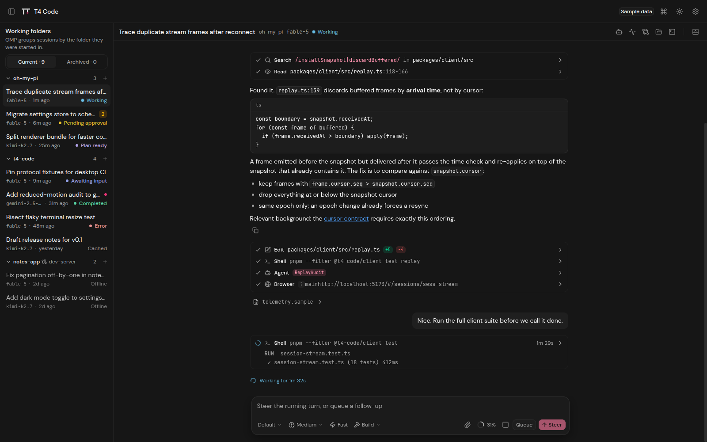
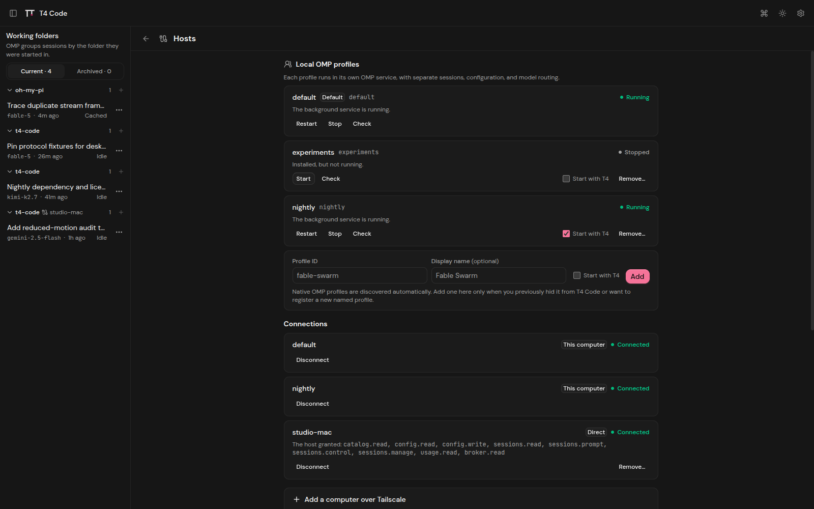
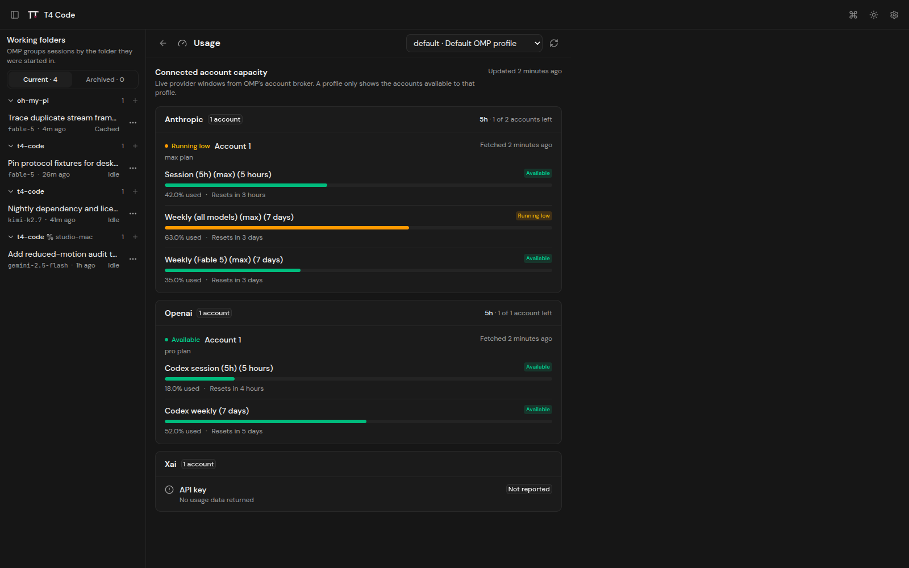
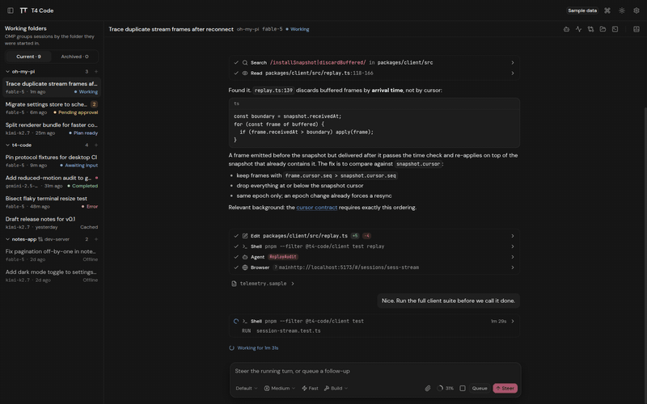
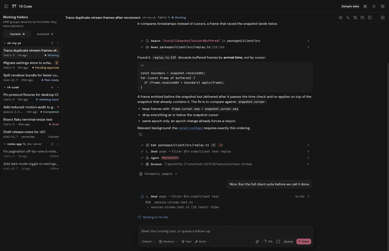

# T4 Code

T4 Code is a free, open-source (MIT) desktop app for [Oh My Pi](https://github.com/can1357/oh-my-pi) (OMP), made for people who live in OMP all day. OMP runs your coding sessions; T4 Code shows them and lets you steer. The app never owns runtime state. It mirrors what the OMP host reports and sends your actions back as commands. It's a ROYCORP project.



[**Download v0.1.22**](https://github.com/LycaonLLC/t4-code/releases/tag/v0.1.22) · [**Docs**](https://t4code.net/docs) · [**Get the source**](#build-from-source)

## Requirements

T4 Code needs an OMP build with desktop appserver support. For v0.1.22, use the public integration build below.

T4 Code v0.1.22 was verified with OMP 17.0.0 built from [`f909a289`](https://github.com/lyc-aon/oh-my-pi/commit/f909a2895bc1a352d1d3c27c45d59622bc1c0a36), tagged [`t4code-17.0.0-appserver-6`](https://github.com/lyc-aon/oh-my-pi/tree/t4code-17.0.0-appserver-6). That public integration is based on the official upstream [`v17.0.0`](https://github.com/can1357/oh-my-pi/tree/v17.0.0) tag at [`d5cd24f3`](https://github.com/can1357/oh-my-pi/commit/d5cd24f39a951bfbd50dc8f50bcf095d59694d6c). It adds lock-aware read-only observation of sessions an OMP TUI is running, complete line-by-line transcript reconciliation, writable promotion only when a session's lock is freshly missing, the cooperative `/continue-in-t4` TUI handoff, and deterministic session file ordering, on top of appserver-4's profile-scoped appservers, host-scoped `usage.read` and `broker.status` commands with redacted results, real thinking levels and fast support, and bounded project catalog resolution. Fork CI rechecks the exact upstream ancestry and release gates before publishing binaries. The official upstream v17.0.0 tag has no `appserver` command, so it cannot host T4 Code. The verified runtime is a normal build from the public `lyc-aon/oh-my-pi` source; T4 Code does not depend on private home-directory files, an auth broker, or a custom Codex CLI fork. T4 Code vendors `@oh-my-pi/app-wire` 0.5.8 from integration commit [`33615123`](https://github.com/lyc-aon/oh-my-pi/commit/33615123ff986fc9cadf645463b4fed17e8b9f35), source tree `e36475dc81dd4c3703eb207ae466f85947b33525`.

| Platform | Arch                  | Package                                  |
| -------- | --------------------- | ---------------------------------------- |
| Android  | arm64, armv7, x86_64  | `.apk` (**signed**)                      |
| Linux    | x86_64                | `.deb`, AppImage                         |
| macOS    | Apple Silicon (arm64) | `.dmg`, `.zip` (**unsigned, see below**) |

No Windows build and no Intel Mac build in v0.1.22. The iOS TestFlight build is coming soon.

## What changed in v0.1.22

- T4 Code follows terminal sessions. A session running as a plain `omp` TUI on the host now appears in T4 Code marked **Active elsewhere**. T4 follows the session's durable transcript — complete records, including saved images, appear as the TUI writes them to disk — and every write control is disabled with the reason. Only a confirmed live lock is called active in another app; a lock that has gone quiet reads as **Waiting to take over**, and a malformed or unrecognized lock keeps the session read-only as "ownership unclear" instead of blaming an app that may not exist.
- Sessions move from the TUI to T4 without a restart. Run `/continue-in-t4` in the TUI (or just exit it). The TUI tears down normally, T4 reconciles the complete transcript line by line, and input returns only after the host confirms the lock is gone and the transcript is complete. Nothing is typed into a session another app still owns, and no transcript line is lost in the handoff.
- Dropped connections now retry for as long as it takes. Retryable transport failures stay in the reconnect loop indefinitely, with backoff capped at 10 seconds, so a network drop, a laptop sleep, or a host restart ends in a reconnected session instead of a dead one.
- On narrow screens, live output from the session you are already reading no longer closes the session rail you just reopened.


<p>
  
  
</p>
<p>
  
  
</p>

## Install

### Android

1. On the Android phone, sign in to Tailscale with an account that can reach the T4 Code host.
2. Download [`T4-Code-0.1.22-android.apk`](https://github.com/LycaonLLC/t4-code/releases/download/v0.1.22/T4-Code-0.1.22-android.apk).
3. If Android asks, allow your browser or file manager to install unknown apps, then install the APK.
4. Open T4 Code and enter the host's HTTPS Tailscale address, including its port. The app saves the address; you can add more hosts later and switch between them.

The APK does not contain an appserver or expose one to the public internet. It connects to the separately running Tailnet gateway on your OMP host.

### Linux (Debian/Ubuntu)

```sh
wget https://github.com/LycaonLLC/t4-code/releases/download/v0.1.22/T4-Code-0.1.22-linux-amd64.deb
sudo apt install ./T4-Code-0.1.22-linux-amd64.deb
```

Use `apt install` rather than `dpkg -i` so system dependencies resolve automatically.

### Linux (AppImage)

```sh
wget https://github.com/LycaonLLC/t4-code/releases/download/v0.1.22/T4-Code-0.1.22-linux-x86_64.AppImage
chmod +x T4-Code-0.1.22-linux-x86_64.AppImage
./T4-Code-0.1.22-linux-x86_64.AppImage
```

### macOS (Apple Silicon)

> [!WARNING]
> **The macOS v0.1.22 build is unsigned and unnotarized.** Apple has not signed or notarized it, so Gatekeeper can report a "damaged" app or an unidentified developer. Only continue if you trust the release from this repository. You can always build from source instead.

1. Download [`T4-Code-0.1.22-mac-arm64.dmg`](https://github.com/LycaonLLC/t4-code/releases/download/v0.1.22/T4-Code-0.1.22-mac-arm64.dmg) (or [`T4-Code-0.1.22-mac-arm64.zip`](https://github.com/LycaonLLC/t4-code/releases/download/v0.1.22/T4-Code-0.1.22-mac-arm64.zip)).
2. Drag `T4 Code.app` into `/Applications`.
3. If Gatekeeper blocks the app and you choose to proceed, remove the quarantine attributes from the copied app bundle:

   ```sh
   xattr -dr com.apple.quarantine "/Applications/T4 Code.app"
   ```

   This command does not sign, notarize, or verify the app. It only removes the quarantine attribute. If Finder offers **Open** after you right-click the app, that is the no-terminal alternative.

## What the app does

- **Sessions.** Browse sessions grouped by their working folder, create new ones, and switch between them. Rename, terminate a stuck runtime, archive, restore, or permanently delete a session from its menu. Recently used sessions stay warm, so switching back is instant and nothing is replayed twice.
- **Composer.** Send prompts, use slash commands (`/model`, `/compact`, `/retry`, `/review`, `/terminal`, and more), and change the session's model, thinking level, or fast mode inline.
- **Panes.** Watch subagents (and cancel them), apply reviews, browse and preview files on the host, and attach to live terminals with real keyboard input and resize.
- **Settings.** Edit host settings over the wire, with an explicit host selector when several hosts are connected; each host keeps its own drafts. Edits stage locally and only apply when the host confirms; a dropped connection never silently writes anything.
- **Hosts & usage.** Run one local appserver per OMP profile, pair remote machines, and read each connected host's account usage and broker status. Everything shown is redacted host truth.
- **Keyboard.** `Ctrl/Cmd+K` search, `Ctrl/Cmd+B` sidebar, `Ctrl/Cmd+1..9` session switch, `Ctrl/Cmd+,` settings. Every workflow is keyboard-operable.

Some actions depend on what the host supports. When a host can't do something (steer a single agent, discard a review, read a file), the control shows as disabled with the reason instead of pretending.

## Local and paired hosts

**Local.** T4 Code looks for the `omp` executable via `$OMP_EXECUTABLE`, your `PATH`, and common install locations (`~/.local/bin`, `/usr/local/bin`, `/opt/omp/bin`, ...). It then manages one appserver per OMP profile for you: a systemd user service on Linux, a launch agent on macOS. Named profiles under `~/.omp/profiles` appear as their own local hosts and can auto-start with the app. Appserver logs land in `~/.local/state/t4-code/appserver` (Linux) or `~/Library/Logs/T4 Code/appserver` (macOS); named profiles log under `profiles/<id>` inside those directories.

**Paired.** Connect to an OMP host on another machine through a `t4-code://pair/...` link generated on that host. Device credentials are encrypted with your OS keychain (Electron `safeStorage`) before they touch disk. Dropped connections reconnect automatically with backoff, and any settings you had staged stay staged until the host confirms.

**Tailnet browser.** A source checkout can serve the web app to a phone through Tailscale Serve; see [Tailnet remote access](docs/TAILNET_REMOTE.md). There is no T4 app password in this mode. Tailscale identity plus your tailnet ACLs or grants are the access boundary, so keep the route on Serve and never enable Funnel. Anyone allowed to reach the node and port can operate the connected OMP appserver.

## First run

1. Install and start OMP on the machine you want to work on.
2. Launch T4 Code. On the same machine, it finds `omp` and offers to start the appserver. For another machine, open the pairing link from that host.
3. Pick a project, pick or create a session, and start working.

## Build from source

Needs Node `^24.13.1` and pnpm `11.10.0`.

```sh
git clone https://github.com/LycaonLLC/t4-code.git
cd t4-code
pnpm install
pnpm dev              # web + desktop in watch mode
pnpm check            # release contract, provenance, lint, typecheck
pnpm test             # workspace tests
pnpm test:soak        # headless 10k-history and 20-reconnect stress checks
pnpm package:linux    # .deb + AppImage into release/
pnpm package:mac:unsigned  # unsigned macOS build (on a Mac)
```

The soak command needs no phone, Android emulator, or macOS simulator. It checks the shared data
path and phone-sized browser UI, but it does not certify Android Keystore behavior, WebView
background/foreground lifecycle, APK installation, or networking on a physical device. Those remain
native release checks.

## Architecture

```
apps/desktop   Electron main process: window, local omp discovery,
               appserver lifecycle, pairing, credential storage
apps/web       React UI (Vite): sessions, composer, panes, settings
packages/      client, protocol, remote, service-manager, ui
```

The UI talks to an OMP host over typed WebSocket frames (`omp-app/1`, via the vendored `@oh-my-pi/app-wire`). State flows host → app as frames; user actions flow app → host as commands. The app projects what it receives and never fabricates state.

## Security and license

- Report vulnerabilities privately; see [SECURITY.md](SECURITY.md). Never in a public issue.
- Contributions: [CONTRIBUTING.md](CONTRIBUTING.md).
- Third-party provenance: [THIRD_PARTY_NOTICES.md](THIRD_PARTY_NOTICES.md) and [`provenance/`](provenance/).
- License: [MIT](LICENSE).
